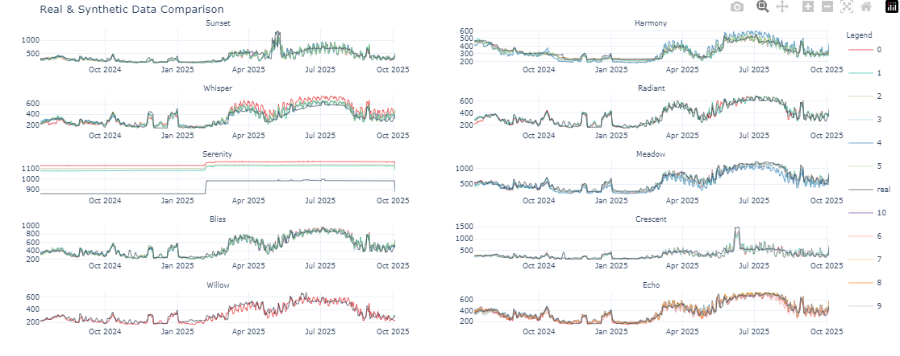

# Synthetic Time Series Data Generation with Gretel-Synthetics



## Overview

This repository showcases the significant achievement of generating synthetic time series data using the `gretel-synthetics` Python library developed by Gretel AI. By leveraging this powerful tool, we successfully created realistic synthetic data that can be used for various analyses without compromising sensitive information.

## Key Features

- **High Fidelity:** The generated data closely mimics the original dataset, ensuring the preservation of important patterns and trends.
- **Privacy Preserving:** No personally identifiable information (PII) is included in the synthetic data, making it ideal for sharing and collaboration.
- **Scalable:** The solution can handle large datasets efficiently, providing robust performance for extensive time series data.

## Example Code

Below is an example of how to use the `gretel-synthetics` library to train a model and generate synthetic data:

```python
from gretel_synthetics import DGAN, DGANConfig

# Configuration for the model
model = DGAN(DGANConfig(
   max_sequence_len = time_line,
   sample_len = sample_length,
   batch_size = 3000,
   epochs = 3000,  # For real data sets, 100-1000 epochs is typical
))

# Train the model with the prepared dataframe
model.train_dataframe(
   df = df_prepared,
   attribute_columns = ['listing_id'],
   example_id_column = ['listing_id']
)

# Generate synthetic data
synthetic_df = model.generate_dataframe(3)
```

## Conclusion

The use of `gretel-synthetics` for generating synthetic time series data represents a major breakthrough in data science and machine learning. This approach not only ensures data privacy but also maintains the integrity of the original dataset, allowing for meaningful analysis and insights.

We invite you to explore the code and replicate the results to see the potential of synthetic data generation in your own projects.
